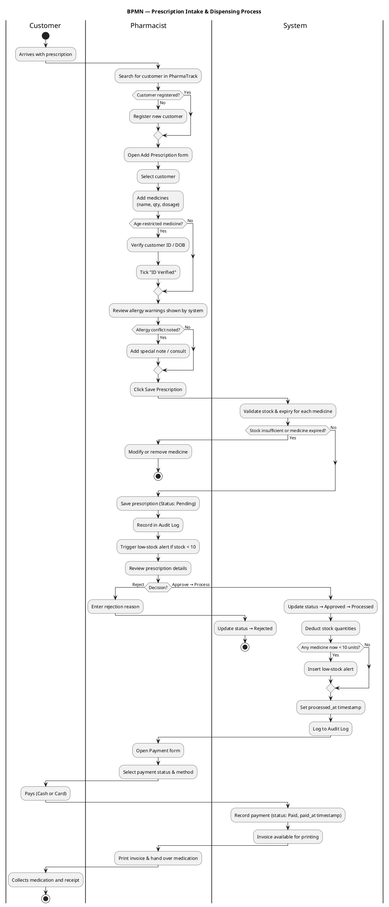
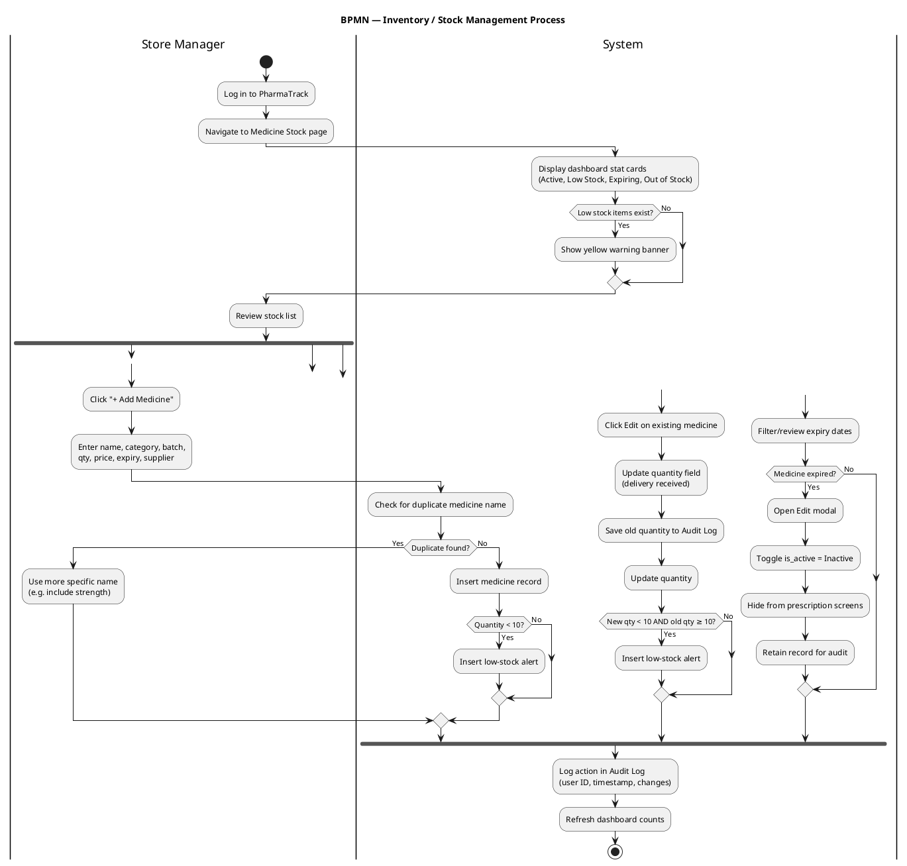
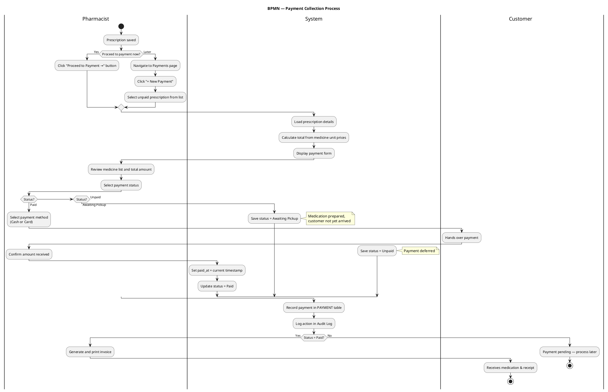

# Business Process Models (BPMN)
> Paste each PlantUML block into https://www.plantuml.com/plantuml/uml/ to render and export as PNG.

---

## BPMN 1 — Prescription Intake & Dispensing

**Description:**
This process begins when a customer arrives at the pharmacy with a physical prescription. The pharmacist locates or registers the customer in PharmaTrack, then creates a prescription record selecting medicines, quantities, and dosage instructions. The system validates stock availability and expiry dates in real time. If an age-restricted medicine is included, the pharmacist must verify the customer's ID before saving. Once saved, the prescription moves through a review workflow — it can be approved, then processed (which triggers automatic stock deduction and a low-stock alert if thresholds are breached), or rejected with a documented reason. Upon processing, the system generates an invoice and the pharmacist records payment. The process concludes when the customer collects their medication.

---

## BPMN 2 — Inventory / Stock Management

**Description:**
The inventory management process is initiated by the Store Manager who monitors stock through the PharmaTrack dashboard. The system automatically surfaces low-stock warnings, expiry alerts, and out-of-stock counts via stat cards. Three parallel sub-processes run as needed: adding new medicines (with a duplicate-name guard), updating existing stock quantities after deliveries (with audit logging of the before and after quantities), and reviewing expiry dates to mark expired medicines inactive. Inactive medicines are immediately hidden from all dispensing screens while their records are retained for audit purposes. All changes are written to the Audit Log with the acting staff member's ID and timestamp.

---

## BPMN 3 — Payment Collection

**Description:**
The payment process is triggered either automatically (via the "Proceed to Payment" button shown after saving a new prescription) or manually from the Payments page. The pharmacist opens the payment form, which pre-loads the prescription summary and auto-calculates the total from medicine unit prices. The pharmacist sets the payment status — Unpaid (deferred), Awaiting Pickup (medication prepared but not yet collected), or Paid (payment received). When marking as Paid, the payment method (Cash or Card) must be selected. The system records the payment, logs the transaction in the Audit Log, and makes the invoice available for printing. The medication is then handed to the customer.

