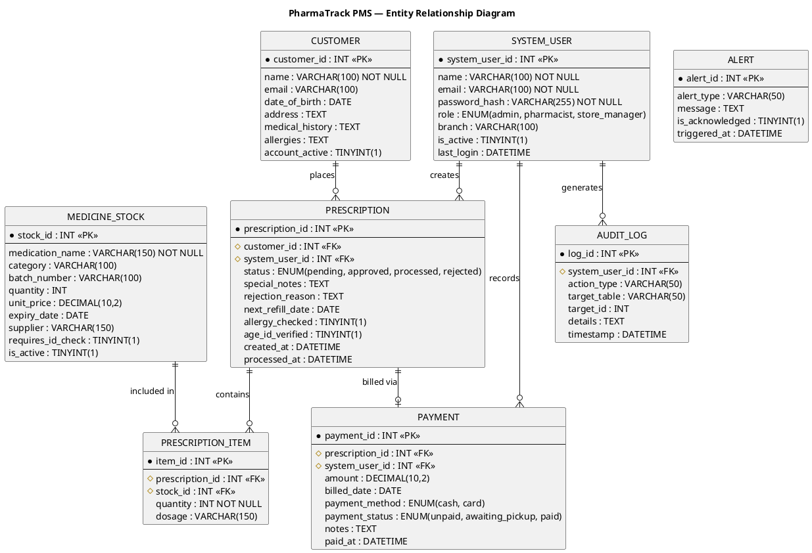

# Entity Relationship Diagram — PharmaTrack PMS
> Paste the PlantUML block into https://www.plantuml.com/plantuml/uml/ to render and export as PNG.

```plantuml
@startuml PharmaTrack_ERD
title PharmaTrack PMS — Entity Relationship Diagram
skinparam linetype ortho
hide circle

entity "CUSTOMER" as customer {
  * customer_id : INT <<PK>>
  --
  name : VARCHAR(100) NOT NULL
  email : VARCHAR(100)
  date_of_birth : DATE
  address : TEXT
  medical_history : TEXT
  allergies : TEXT
  account_active : TINYINT(1)
}

entity "SYSTEM_USER" as sysuser {
  * system_user_id : INT <<PK>>
  --
  name : VARCHAR(100) NOT NULL
  email : VARCHAR(100) NOT NULL
  password_hash : VARCHAR(255) NOT NULL
  role : ENUM(admin, pharmacist, store_manager)
  branch : VARCHAR(100)
  is_active : TINYINT(1)
  last_login : DATETIME
}

entity "PRESCRIPTION" as prescription {
  * prescription_id : INT <<PK>>
  --
  # customer_id : INT <<FK>>
  # system_user_id : INT <<FK>>
  status : ENUM(pending, approved, processed, rejected)
  special_notes : TEXT
  rejection_reason : TEXT
  next_refill_date : DATE
  allergy_checked : TINYINT(1)
  age_id_verified : TINYINT(1)
  created_at : DATETIME
  processed_at : DATETIME
}

entity "PRESCRIPTION_ITEM" as prescitem {
  * item_id : INT <<PK>>
  --
  # prescription_id : INT <<FK>>
  # stock_id : INT <<FK>>
  quantity : INT NOT NULL
  dosage : VARCHAR(150)
}

entity "MEDICINE_STOCK" as medicine {
  * stock_id : INT <<PK>>
  --
  medication_name : VARCHAR(150) NOT NULL
  category : VARCHAR(100)
  batch_number : VARCHAR(100)
  quantity : INT
  unit_price : DECIMAL(10,2)
  expiry_date : DATE
  supplier : VARCHAR(150)
  requires_id_check : TINYINT(1)
  is_active : TINYINT(1)
}

entity "PAYMENT" as payment {
  * payment_id : INT <<PK>>
  --
  # prescription_id : INT <<FK>>
  # system_user_id : INT <<FK>>
  amount : DECIMAL(10,2)
  billed_date : DATE
  payment_method : ENUM(cash, card)
  payment_status : ENUM(unpaid, awaiting_pickup, paid)
  notes : TEXT
  paid_at : DATETIME
}

entity "ALERT" as alert {
  * alert_id : INT <<PK>>
  --
  alert_type : VARCHAR(50)
  message : TEXT
  is_acknowledged : TINYINT(1)
  triggered_at : DATETIME
}

entity "AUDIT_LOG" as audit {
  * log_id : INT <<PK>>
  --
  # system_user_id : INT <<FK>>
  action_type : VARCHAR(50)
  target_table : VARCHAR(50)
  target_id : INT
  details : TEXT
  timestamp : DATETIME
}

' ── Relationships ──────────────────────────────────────
customer        ||--o{  prescription  : "places"
sysuser         ||--o{  prescription  : "creates"
prescription    ||--o{  prescitem     : "contains"
medicine        ||--o{  prescitem     : "included in"
prescription    ||--o|  payment       : "billed via"
sysuser         ||--o{  payment       : "records"
sysuser         ||--o{  audit         : "generates"

@enduml
```
