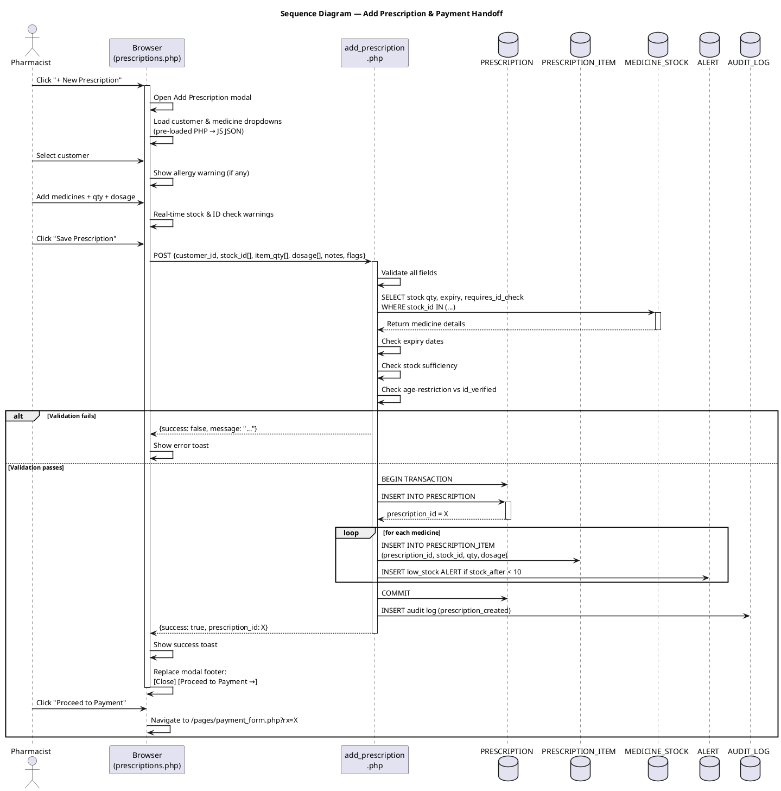
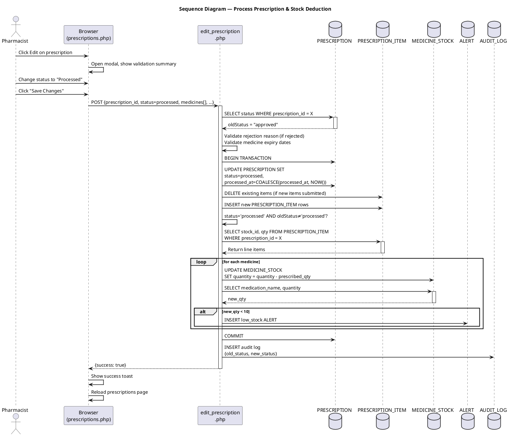
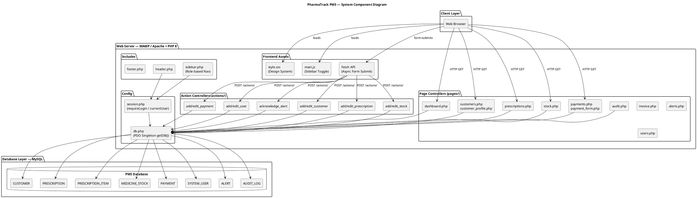
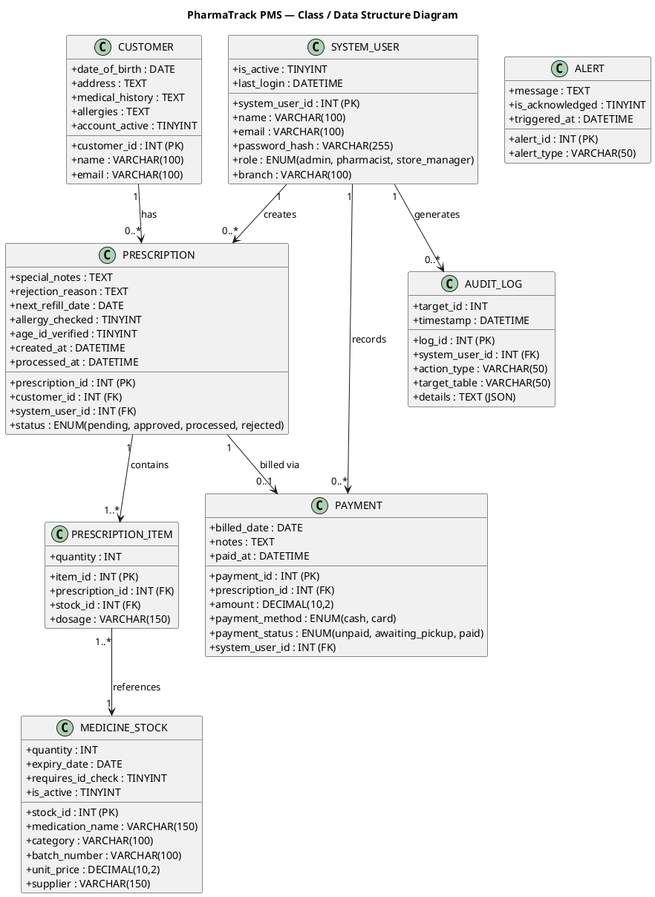

# System Models
> Paste each PlantUML block into https://www.plantuml.com/plantuml/uml/ to render and export as PNG.

---

## 1. Use Case Diagram

**Description:**
The use case diagram identifies three primary internal actors — Admin, Pharmacist, and Store Manager — plus the Customer as an external actor for future self-registration capability. The Admin has unrestricted access to all modules. The Pharmacist handles the clinical workflow: customer management, prescription lifecycle, and payment recording. The Store Manager focuses on inventory operations. Use cases are grouped into five functional areas: Customer Management, Prescription Management, Inventory Management, Payment Management, and System Administration. Role-based access control (RBAC) is enforced at session level via the `requireRole()` function.

```plantuml
@startuml Use_Case_Diagram
left to right direction
title PharmaTrack PMS — Use Case Diagram

skinparam actorStyle awesome
skinparam packageStyle rectangle

actor "Admin" as AD #lightblue
actor "Pharmacist" as PH #lightgreen
actor "Store Manager" as SM #lightyellow
actor "Customer\n(Future)" as CU #lightgrey

rectangle "PharmaTrack PMS" {

  package "Customer Management" {
    usecase "Register Customer" as UC1
    usecase "Search & View Customers" as UC2
    usecase "Edit Customer Details" as UC3
    usecase "View Prescription History" as UC4
  }

  package "Prescription Management" {
    usecase "Create Prescription" as UC5
    usecase "Edit / Update Prescription" as UC6
    usecase "Approve Prescription" as UC7
    usecase "Process & Dispense" as UC8
    usecase "Reject Prescription" as UC9
    usecase "View Prescription Details" as UC10
  }

  package "Inventory Management" {
    usecase "Add Medicine to Stock" as UC11
    usecase "Update Stock Quantity" as UC12
    usecase "Search & Filter Medicines" as UC13
    usecase "Sort Inventory" as UC14
    usecase "Mark Medicine Inactive" as UC15
    usecase "View Expiry Alerts" as UC16
  }

  package "Payment Management" {
    usecase "Record Payment" as UC17
    usecase "Update Payment Status" as UC18
    usecase "View Payment History" as UC19
    usecase "Generate & Print Invoice" as UC20
  }

  package "System Administration" {
    usecase "Manage System Users" as UC21
    usecase "View Audit Log" as UC22
    usecase "Acknowledge Alerts" as UC23
  }
}

PH --> UC1
PH --> UC2
PH --> UC3
PH --> UC4
PH --> UC5
PH --> UC6
PH --> UC7
PH --> UC8
PH --> UC9
PH --> UC10
PH --> UC13
PH --> UC17
PH --> UC18
PH --> UC19
PH --> UC20
PH --> UC23

SM --> UC11
SM --> UC12
SM --> UC13
SM --> UC14
SM --> UC15
SM --> UC16
SM --> UC17
SM --> UC18
SM --> UC19
SM --> UC23

AD --> UC1
AD --> UC2
AD --> UC3
AD --> UC5
AD --> UC6
AD --> UC7
AD --> UC8
AD --> UC9
AD --> UC11
AD --> UC12
AD --> UC15
AD --> UC17
AD --> UC21
AD --> UC22
AD --> UC23

CU --> UC4

@enduml
```

---

## 2. Sequence Diagram — Add Prescription & Proceed to Payment

**Description:**
This sequence diagram illustrates the interaction between the Pharmacist, browser, backend PHP controllers, and the MySQL database when creating a new prescription. The browser sends a POST request to `add_prescription.php` which validates all inputs server-side (stock availability, medicine expiry, ID verification for age-restricted drugs). On success, the prescription and line items are persisted across two tables. The response includes the `prescription_id`, which the browser uses to dynamically replace the modal footer with a "Proceed to Payment" button, enabling a seamless handoff to the payment workflow without a full page reload.

---

## 3. Sequence Diagram — Process Prescription (Stock Deduction)

**Description:**
This diagram shows the stock deduction flow when a pharmacist changes a prescription's status to "Processed". The `edit_prescription.php` controller first fetches the current status to detect the transition. Stock is only deducted once — on the first transition to "processed" — ensuring idempotency if the record is saved again later. For each medicine line item, the stock quantity is decremented and a low-stock alert is inserted if the new level falls below ten units. The `processed_at` timestamp is set using `COALESCE` so it is never overwritten on subsequent edits.

---

## 4. System Component Diagram

**Description:**
PharmaTrack follows a three-tier architecture: a Client Layer (web browser), a Web Server Layer (MAMP running Apache with PHP 8), and a Database Layer (MySQL). Within the web server, the frontend consists of custom HTML/CSS and vanilla JavaScript using the Fetch API for asynchronous communication with the backend. The backend is split into Page Controllers (which render full HTML views) and Action Controllers (which handle POST requests and return JSON). All controllers access the database through a centralised PDO singleton (`getDB()`). This design keeps the database connection logic in one place and enables consistent error handling and transaction support across all modules.

---

## 5. Class Diagram (Data Structure Model)

**Description:**
The class diagram represents the core data entities of PharmaTrack and their relationships. A `CUSTOMER` can have many `PRESCRIPTION` records. Each `PRESCRIPTION` is created by a `SYSTEM_USER` and may have one associated `PAYMENT`. The many-to-many relationship between prescriptions and medicines is resolved through the `PRESCRIPTION_ITEM` junction table, which also stores the prescribed quantity and dosage instructions. `MEDICINE_STOCK` records are the source of truth for availability and pricing. The `ALERT` and `AUDIT_LOG` tables serve as system-wide event records, decoupled from any single entity.

